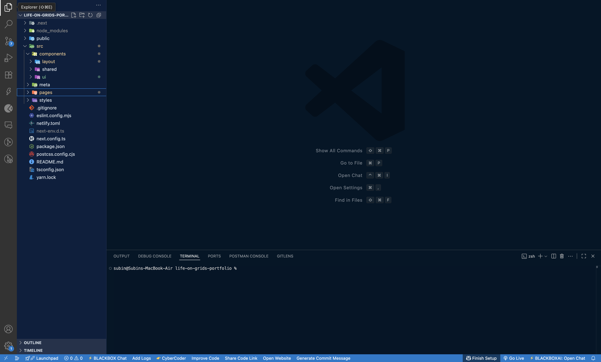
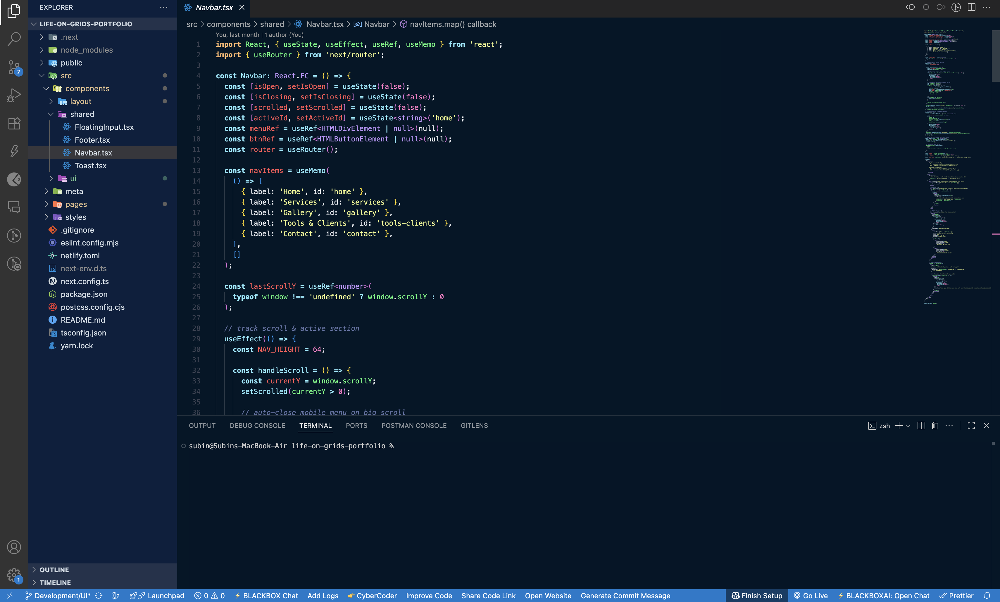
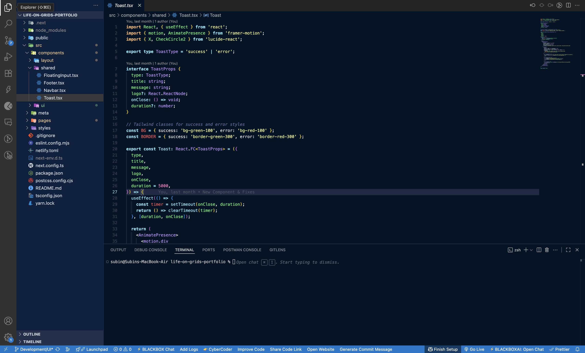
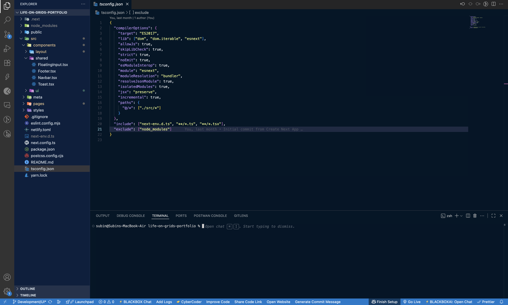

# Aurora Nightfall

_A vivid rainbow gleams softly on a deep, dark canvas._

Aurora Nightfall combines a near-black background with a lively rainbow spectrum—ensuring each code element pops with its own distinct hue. Designed for long coding sessions, it emphasizes both clarity and visual flair.

---

##  Theme Highlights

- **Calm base**: A rich, near-black background for minimal eye fatigue.
- **Rainbow syntax**: Standout colors for:
  - `const`, `let`, `var`, general variables
  - Functions, types, strings, keywords, numbers, imports, tags, etc.
- **Navigational clarity**: Slightly lighter sidebar with subtle borders for clear UI structure.

---

##  Showcase

*(Include captivating screenshots to demonstrate the theme in action)*

```markdown




